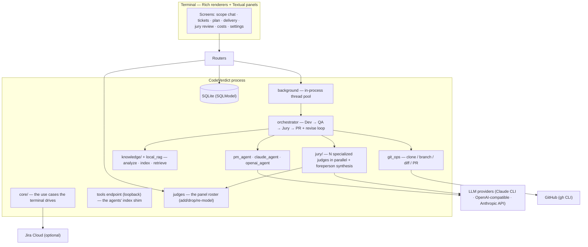

# Architecture

CodeVerdict is a control plane for an autonomous software-development pipeline.
A human describes a feature in plain English; a chain of specialized agents scopes
it, writes the code on an isolated branch of a cloned repo, tests it, reviews it,
and (optionally) opens a real pull request — each agent grounded in a retrieval
knowledge base built from the target repository.

## Components



The interface is the terminal: Rich renderers for everything that streams, and
Textual panels for the three views that need two dimensions (the jury review,
settings, the roster). No build step, no browser, no CDN — it runs fully offline.

## The pipeline

```
ingest repo → build knowledge base (code graph + semantic index)
  → PM agent clarifies the request + drafts tickets → human approval (+ optional Jira)
  → Planner reads the repo and decides HOW: ordered steps, verified file:line pins,
    blast radius, tests to extend
  → Dev agent implements the plan on an agent/<key> branch of a cloned working copy
  → QA agent runs tests + reviews                    ┐
  → Jury: N specialized judges review independently   ├─ revise loop ×N on failure
  → Foreperson merges their opinions into one verdict │
  → PR stage pushes + opens a real PR        ┘
  → human merges
```

### Why a separate Planner

The PM talks to a human; the Planner talks to the repository. Keeping them apart
is the single biggest structural decision here, and it follows the measurement in
the literature: removing the planner from a multi-agent pipeline drops it to
single-agent performance (AgentForge), and specialized planning/navigation roles
beat one all-purpose agent (HyperAgent).

Concretely, the PM works from summaries and never opens the code, so its guesses
about *which file* were wrong often enough to matter — one live run pinned
`Table.__rich__` to `rich/json.py` and sent the Dev agent at three files it had
no business editing. The PM now owns the requirement and the acceptance criteria
and nothing else. The Planner runs at pipeline entry, when the working copy is
clean and the code graph is current, queries the index directly, and emits a plan
whose every symbol is then **deterministically verified** against the graph, the
symbol map and ripgrep. A symbol that resolves nowhere is marked as new rather
than silently pointed at whatever matched first.

Its output replaces the ticket's localization, and is read by Dev (as the
approach), by QA and the jury (as what the diff is supposed to be doing), and by
the human (in the task drawer).

### Retrieval: one pipeline, called by every agent

`knowledge/retriever.retrieve_context` is five stages, each independently
switchable so their contribution is measurable rather than assumed
(see `benchmarks/retrieval-ablation.md`):

| # | Stage | What it adds |
|---|---|---|
| 1 | **fuse** | BM25 over graph nodes + local dense embeddings, weighted RRF |
| 2 | **expand** | each top hit's 1-hop neighbourhood — callers, callees, class members, covering tests |
| 3 | **refine** | ripgrep over the query's identifiers: strings, comments, config, templates the AST index cannot model |
| 4 | **rerank** | one order out of four incomparable score scales |
| 5 | **snippets** | the winners' real source, or a cached summary when a node is too large to inline |

The same stages back the callable tools (`search`, `lookup`, `callers`, `expand`,
`outline`, `snippet`, `grep`) that the Planner, the Dev agent, QA and every juror
reach through — one dispatcher, four surfaces, no tool exclusive to one vendor's
agent.

### Sequence of a pipeline run

```mermaid
sequenceDiagram
    autonumber
    actor User
    participant API as tasks router
    participant BG as background (thread pool)
    participant Orch as orchestrator
    participant KB as knowledge base
    participant Git as git_ops
    participant Dev as Dev agent
    participant QA as QA agent
    participant DB as SQLite

    User->>API: POST /tasks/{id}/run
    API->>DB: load task; assert approved
    API->>BG: submit(run_pipeline, id)
    API-->>User: 200 (returns immediately)
    Note over User: UI polls /agents/runs + /tasks/board

    BG->>Orch: run_pipeline(id)
    Orch->>Git: ensure_clone + checkout agent/<key>
    Orch->>KB: retrieve scoped, file-cited context
    Orch->>Dev: implement ticket with injected context
    Dev-->>Orch: streamed tool-use/text events → live logs
    Orch->>Git: commit + diff
    Orch->>QA: run tests + review the diff
    QA-->>Orch: VERDICT + findings
    Orch->>Dev: review the diff vs acceptance criteria
    Dev-->>Orch: APPROVED / CHANGES REQUESTED
    alt DEMO_MODE
        Orch->>DB: log "would open PR: ..."
    else real PR
        Orch->>Git: push + gh pr create → pr_url
    end
    Orch->>DB: finalize runs; advance task status
```

**The HTTP request returns before the work starts.** The router validates and
enqueues; the orchestrator runs on a worker thread and communicates progress purely
through database writes that the UI polls. This keeps the request cycle fast and
lets a run survive a client disconnect.

## The agents

| Agent | Default role | Prompt source |
|---|---|---|
| **PM** | Clarify the request in a Socratic loop, then draft approvable tickets | `pm_agent` |
| **Planner** | Decide how the change is made; verify every pin against the graph | `planner` |
| **Dev** | Implement the plan in a cloned working copy | `prompts.dev` / `prompts.revise` |
| **QA** | Run tests and review the diff skeptically | `prompts.QA_SYSTEM` / `qa_user` |
| **Jury** | A panel of specialized judges reviews the diff independently, in parallel, each on its own model | `jury/personas.py` + `jury/prompts.py` |
| **Foreperson** | Merge the judges' opinions, resolve conflicts, drop guesses, decide | `jury/synthesis.py` |
| **Review** (jury off) | Single-reviewer fallback: review the diff against the acceptance criteria | `prompts.review` / `REVIEW_SYSTEM` |
| **PR** | Push the branch and open the PR (the `gh` CLI, not an LLM) | `prompts.pr_body` |

Each stage's provider and model are configurable independently — see
[configuration.md](configuration.md).

## Two design ideas worth calling out

### Cross-provider bias reduction

The agent that *writes* the code and the agent that *reviews* it are deliberately
different model families. Author and reviewer having uncorrelated blind spots means a
bug one model can't see, the other is more likely to catch. The default posture puts
a frontier model on the Dev step (the one stage that genuinely needs it) and cheaper
models on QA/Review — see the [benchmarks](../benchmarks/kb-vs-claude-code.md) for why
that split holds up in practice.

### Bounded revise loop

The orchestrator is a sequential state machine over `TaskStatus`, chosen over a graph
framework for transparency. On top of it sits a control loop: if QA fails or Review
requests changes, the feedback is fed back to the Dev agent and QA + Review re-run, up
to `MAX_REVISION_ROUNDS` times. Verdicts are parsed from free text with deliberately
conservative rules — an explicit `VERDICT: FAIL` triggers a revision, but a softer
`CONCERNS` does not, and an agent call that errors with no verdict at all is stamped
`INCONCLUSIVE` rather than silently read as a pass. (These rules are unit-tested in
[`tests/test_orchestrator_verdicts.py`](../tests/test_orchestrator_verdicts.py).)

### Trivial-task fast path

The benchmarks show the pipeline's one structural loss: the fixed PM+QA+Review gate
floor (~$0.14) makes very cheap greppable edits cost more than a cold `claude -p`. The
fast path targets exactly that case. Triage is deterministic on both sides of Dev — no
LLM self-estimate, for the same reason `ground_tickets` greps instead of asking a
model: pre-Dev the scope must be a single ticket with small, grep-pinned localization
(every target symbol resolved to a real definition site); post-Dev the actual diff must
stay small (non-test files/lines) and the deterministic test gate must come back green
(a runnable suite with zero new failures against the pre-Dev baseline). Only when all
of that holds are the LLM QA and Review passes skipped, with explicit fast-path
verdicts stamped on the tasks — never blank summaries, which downstream would read as
"no issues". Anything short of full verification (no runnable suite, new failures, a
bigger diff than triaged) falls through to the normal QA + Review loop. Beyond the
gate-cost saving, the fast path also removes the LLM-QA false-fail risk that burns
paid revision rounds on exactly these small changes. `FAST_PATH_ENABLED=false` turns
it off.

## Execution model

The Dev and Review agents don't use a bespoke tool schema — when pointed at the Claude
Code CLI they drive it as a subprocess, which is itself an agent with file-editing
tools. `claude_agent.run_claude` parses the CLI's `stream-json` events (`tool_use`,
`text`, `result`), turning real tool calls into live log lines and reading exact cost
from the final event. The OpenAI-compatible coding path instead uses structured JSON
output (`{files: [{path, content}]}`) that the service writes to disk behind safety
guards.

Every agent run records real tokens, cost, and duration, rolled up per ticket, per
scope, and per agent on the Costs screen.

## Persistence

State lives in SQLite via SQLModel — repos, scope sessions, chat messages, tasks,
agent runs, log entries, users, auth sessions, and runtime setting overrides. Schema
creation is `SQLModel.metadata.create_all`, with a small additive migration step in
[`database.py`](../backend/app/database.py) that `ALTER TABLE`s in new columns so an
existing database keeps working across upgrades.

## Safety posture

- **`DEMO_MODE` is on by default** — the PR stage is a dry-run that logs the PR it
  *would* open and never pushes, until you explicitly opt in and authenticate `gh`.
- **Nothing is served to a browser.** The only socket CodeVerdict opens is a
  loopback endpoint for the agents' index shim, authenticated by a per-run token
  minted in memory; the shim cannot name its own repo or working copy.
- **API keys are encrypted at rest** (Fernet) when saved from the Settings panel.
- The agents execute code from cloned repositories, so treat the host accordingly —
  the Docker image runs as a non-root user, and untrusted repos should be sandboxed
  (see [Future work](../README.md)).
